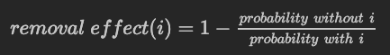
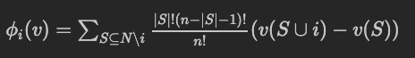
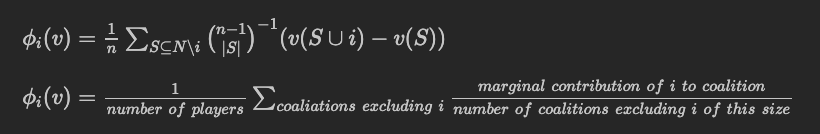
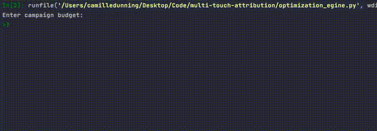

# Attribution Modelling and Budget Optimization
Our goal is to go through a set of channels of marketing campaigns (Instagram, Paid Search, etc.) before a customer converts. How do we attribute to this conversion? Could it be because of Facebook, Instagram, or various channels contributing equally? 
## *Rule-Based Engine*: Single-Touch Attribution Models
These focus on giving a 100% carrier credit to only one touch point in a user journey, by which we mean a marketing campaign channel. A last-touch attribution model may give 100% credit to a customer's most recent touch point. A last non-direct touch attribution may look at traffic that was guided to your website from another source, like a link on a Twitter post, and observe the last touch point in this journey.
### Last-Touch Attribution Model
Here, we assign 100% of the carrier credit to the last marketing touchpoint. 
> The argument behind this approach is that the last touch is all that matters because it resulted in the actual conversion, but in reality, it doesn't tell the whole story.

### First-Touch Attribution Model
Here, a customer's first marketing interaction will receive 100% of the coversion credit. 
> If one is mainly focused on widening [the] top of [their] funnel, this is a useful model. It highlights the channels that first introuced a customer to [the] brand.

The problem with this model is that it ignores all subsequent touches, and therefore provides no insight into down-funnel metrics.

### Last Non-Direct Attribution Model
This model ignores direct traffic, and it
> assigns 100% of the credit to the last channel the user engaged with before making a conversion.

This is best used if one wants to understand effectiveness of their final marketing activities without direct traffic getting in the way of their analysis. However, this is still ignoring the other campaigns and channels with which the customer interacted.

## *Rule-Based Engine*: Multi-Touch Attribution Models
There might be a lot of biases involved in single-touch attribution models: 100% credit for one channel won't usually make practical sense. These include **linear atribution models**, **position-based (U-shaped) models**, **position decay attribution models**, among others.

### Linear Attribution Model
The Linear Attribution Model gives each touchpoint across the buyer journey the same amount of credit toward driving a sale; it values every touchpoint evenly. This model is easy to implement and is better than all the single-touch attribution models. The *disadvantage* here is that in reality, consumers aren't equally impacted by every kind of channel.

### Position-Based (U-Shaped) Attribution Model
This model splits the credit for a sale between the first interaction and the moment it converts.
> 40% of the credit is given to each of these points, with the remaining 20% spread out between any other interactions that happened in the middle.

### Position Decay Multi-Touch Attribution Model
This algorithm allocates points to all the channels used to conert, giving them credit in ascending order up to the last interaction. This modle assumes that a user's interest in a product grows with every interaction, and the last one is the most important as it determines whether a customer converts.

## Probabilistic Attribution Models
Probabilistic Attribution is a process that relies on statistical modeling and machine learning techniques to derive probability of conversion across all marketing touchpoints. These can then be used to weigh the value of each touchpoint preceding the conversion.

### Markov Attribution Model
The Markov Attribution model will represent buyer journeys as a directed graph, with the nodes being the touchpoints or "states", and the graph's connecting edges being the observed transitions between those states. 
> The **key ingredient** to the model is the transition probabilities (likelihood of moving between states). The number of times buyers have transitioned between two states is converted into a probability, and the complete graph can be used to measure the importance of each state and most likely paths to success.

This model should be used when the number of channels for a particular campaign is between 10 and 15.

#### Removal Effect
> A campaign's effectiveness is determined by removing it from the graph and simulating buyer journeys to meausre the change in success rate without it in place.

If we want to find a channel's contribution, we can do so by removing it, and seeing how many conversions take place without that channel existing.

From these experiments, I aim to build a simple budget optimization engine.

### Shapley Value Model
Shapley value models provide a stable way to measure influence of a channel and fairly divide the credit for sales conversions between channels based on their individual contribution to total pay off.
> Cooperative game theory and the Shapley value provide marketing departments with an accurate and tailored solution for attribution that has the potential to deliver much more than the rule-based models are able to provide.

These should be used when there are 15 or more channels in a particular campaign.

- Considering a multi-player game, in which players work together to increase the likelihood of a desired result, Shapley value provides a way to fairly divide the payoffs between the players
- Measure of players' average marginal contribution to each coalition. Players can join a coalition in different points of time, and are of varying degrees of influence. **Each ordering has the same probability of occurring. Each player is awarded by contributions of permutations.**

> A coalition of players cooperates, and obtains a certain overall gain from that cooperation. Since some players may contribute more to the coalition than others or may possess different bargaining power, what final distribution of generated surplus among the players should arise in any particular game? Or phrased differently: how important is each player to the overall cooperation, and what payoff can he or she reasonably expect? The Shapley value provides one possible answer to this question.

The campaign channels act as the players here. The various ways (subsets) in which channels interact with accounts throughout the journey are the coalitions. The characteristic function, *v*, assigns a value to each outcome (conversion), and the conversion represents the payoff when the channels work together of the journey. This might also be represented by revenue, or the total number of sales conversions, etc.

#### Formal Definition
A **coalitional game** is a set *N* of *n* players and a function *v* that maps subsets of players to real numbers: *v: 2^N --> R*

If *S* is a coalition of players, then *v(S)*, called the *worth* of coalition *S*, describes the *total expected sum* of payoffs the members of *S* can obtain by cooperation.

The Shapley value distributes the total gains of players, assuming that they *all* cooperate. The amount that the player *i* gets given a coalitional game *(v, N)* is:

where *n* is the total number of players and the sum extens over **all subsets of $S$ of $N$ not containing players *i***. *Interpretation*: Imagine the coalition being formed one actor at a time, with each actor demanding their contribution *(v(S U {i})- v(S))* as a fair compensation, and then for each actor take the average of this contribution over all the possible different permutations in which the coalition can be formed. This formula can also be expressed as:

## Evaluation
Facebook and Paid Search seem to dominate in most with most of the models. Online Display has been almost entirely consistent in getting the lowest conversion credit. We'll take the mean across all models to get rid of biases. Even though our results are similar across the board, we should aggregate our results because we might want to invest \$1 million dollars into one marketing channel. For now, well use our means as the final weighting. We could experience with different weightings and aggregations by means of A/B-testing over several months.

Some other aggregate measures we can try are the median or quantile-based measures. 

It's important to note that we shouldn't *just* invest in Paid Search and Facebook, or else we can lose valuable customers.

## Budget Optimization Engine Demo
I used `gekko` for optimization. The coefficients are derived from the mean weights of each marketing campaign channel (ensemble model combining all eight models), and I used a simple linear optimization model subject to $100 for the lower bound and the user-inputted budget for the upper bound.

